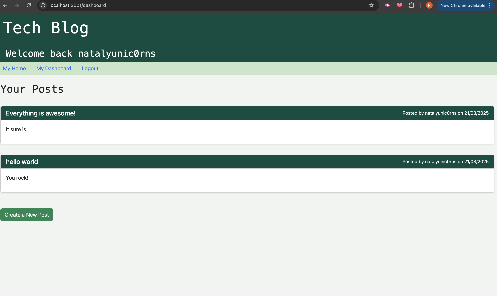

# nat-tech-blog

## Description 

The challenge is to build a CMS-style blog site similar to a Wordpress site, where developers can publish their blog posts and comment on other developers’ posts as well. You’ll build this site completely from scratch and deploy it to Render. Your app will follow the MVC paradigm in its architectural structure, using Handlebars.js as the templating language, Sequelize as the ORM, and the express-session npm package for authentication.

## User Story

AS A developer who writes about tech
I WANT a CMS-style blog site
SO THAT I can publish articles, blog posts, and my thoughts and opinions

## Installation 

Install dependencies with 'npm install', run 'node server.js'

## Screenshot 

## Usage

Visit the render website: https://nat-tech-blog.onrender.com/

## Resources

<a href="https://www.geeksforgeeks.org/mvc-design-pattern/">Geeks for Geeks</a>
<a href="https://www.freecodecamp.org/news/the-model-view-controller-pattern-mvc-architecture-and-frameworks-explained/">Free Code Camp</a>
<a href="https://stackoverflow.com/questions/61850072/how-to-make-a-create-view-controller-method-for-a-model-that-has-a-list-field">Stack Overflow</a>
